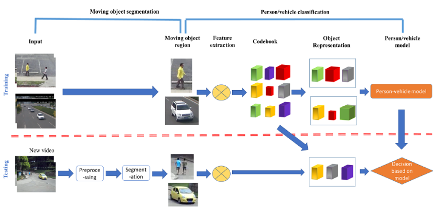
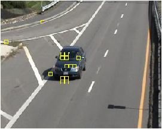
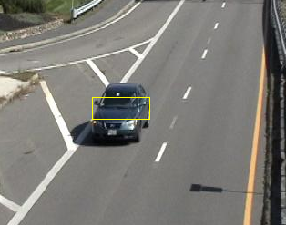
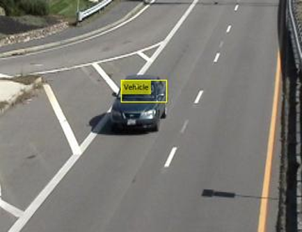

# Image_segmentation_and_Classification_HEVC_videos-
Image segmentation and Classification of Highly Efficient video Encoding(HEVC) videos.

## PREPROCESSING
One MV in compressed videos coded under HEVC is related with an inter-coded PU. MV's, changed acceptably so that they can be made autonomous of the type of frame. For this to happen MVs are divided on the basis of the contrast between the reference frame value(in display order) and the corresponding frame value. For Ex: let's say the value of a MV for frame- A be (2,2) while for other frame-B the value of MV be (6,6) which is adjacent block to the reference frame, both the MV values for frame-A and frame-B would be changed to both (4,4) after the procedure used to scale MVs.
The PUs which have 2 MVs, the MV with the bigger value of length would be chosen as the characteristic MV of the PU. The prior processing causes the interpolation of MV for intra-coded blocks and the elimination of outliers from MV to be used prior to the segmentation and classification of the object.

## MOVING OBJECT DETECTION
After the preprocessing stage of the MVs, all the blocks having MVs with values greater than zero are called as foreground blocks. On these blocks the four-connectivity component labeling algorithm is applied so that these blocks can be grouped into the connected regions which is present in foreground. Each foreground area is first examined to determine consistency values temporally by including object space tracking. After that the boundary of the area of the moving object is refined by the CU and PU sizes of the blocks.

## FEATURE EXTRACTION
For the proposed system three types of features have been identified,
• The length of prediction modes
• Motion Vector Difference (MVD)
• Motion Vectors
as an efficient features that can be used for classification of object. Firstly the value of MV length is calculated and it is related to the velocity of the object, which is a naive but a very important feature for classification of MVs either into a person or a vehicle because generally vehicles have a faster pace as compared to people. There is an observation that people generally suffer from non-rigid deformations , it is difficult to find a lookalike for every single PU in the region of people in motion.
`
The blocks which lie in and near the area of moving vehicles are coded with intra mode less as compared to the region surrounding person. That is why we can utilize the prediction unit in a efficient way.

## CLASSIFICATION
For classification of objects in HEVC videos, classification of the segmented objects either into a vehicles or a persons with “bag of HEVC syntax words” in HEVC domain. The “bag of words” characterization which has been used successfully for classification of objects in the pixel domain .

